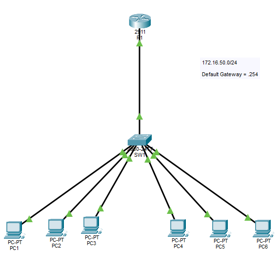

# DHCP + NTP Configuration

## Objective:

Configure a router as a DHCP Server and an NTP server in a subnet.

## Topology


## Learning Outcomes
- MUST include the default gateway in the "default-router" configuration inside the pool.

DHCP CLI:
```
(condif)#
ip dhcp excluded-address __starting_ip__ __ending_ip__              ## only input one ip if exluding a specific one.

ip dhcp pool __name__                                               ## create DHCP pool
network __ip__
dns-server __ip__
domain-name __name__
default-router __default_gateway__
```

NTP CLI:
```
ntp master
ntp server __ip__

clock set __:__:__ __ __ __                 ## hour:min:second day month year
clock update-calender

(config)#
clock timezone __timezone__ __+-hours_from_timezone__
```

(Might need repetition for a better familiarity.)