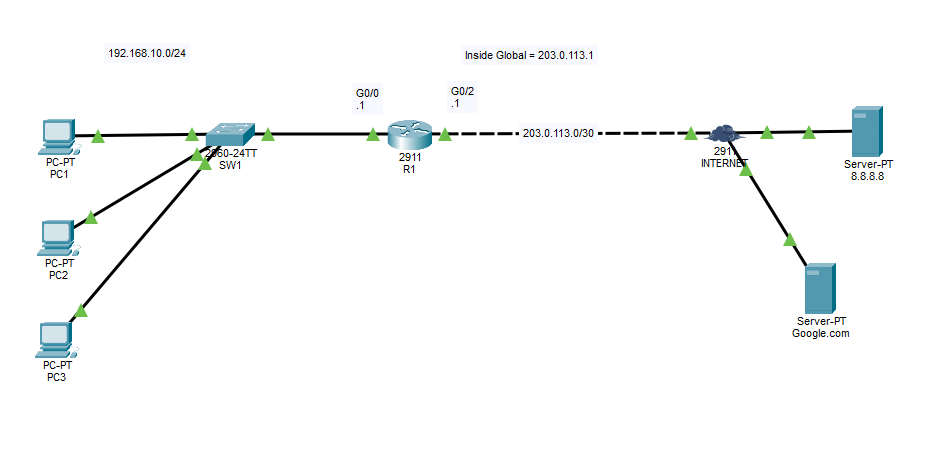

# DHCP + PAT Configuration

## Objective:

Configure PAT and DHCP for a LAN to access DNS server and ping "Google.com" over the internet.

## Topology


## Learning Outcomes
- PAT (Nat overload) a single port seems to be the more common practice in real-life scenarios unless the compnay size is so significant that it has a lot of public IP addresses to spare.
- Must configure an access list to tell routers which ip addresses to be translated.

DHCP CLI:
```
(condif)#
ip dhcp excluded-address __starting_ip__ __ending_ip__              ## only input one ip if exluding a specific one.

ip dhcp pool __name__                                               ## create DHCP pool
network __ip__
dns-server __ip__
domain-name __name__
default-router __default_gateway__
```

ACL CLI:
```
(config)#
access-list __num__ permit __network-ip__ __subnet-mask__               #### to be used in PAT configuration
```


PAT CLI:
```
(config)#
ip nat pool __name__ __start-ip__ __end-ip__ netmask __subnet-mask__                #### for creating inside global address pool

ip nat inside source list __access-list__ interface __port__ overload               #### PAT on a single port with one public IP
ip nat inside source list __access-list__ pool __pool-name__ overload               #### PAT with a pool of public IP addresses
```