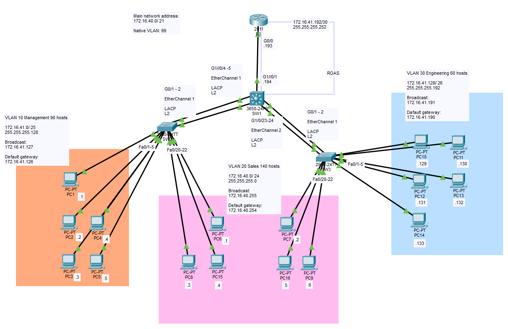

# EtherChannel

## Objective:

Design a network based on a single network block: 172.16.40.0/21.

| VLAN ID |   Department   | Number of Hosts |
|---------|----------------|-----------------|
|    10   |   Management   |    90 hosts     |
|    20   |   Sales        |    140 hosts    |
|    30   |  Engineering   |    60 hosts     |

Utilising SVI, VLANs and Etherchannel, as well as a Router-On-A-Stick setup.
PCs should be able to communicate with each other across VLANS.

## Topology


## Subnets

|   Management   | IP Address        |
|----------------|-------------------|
|     Network    | 172.16.41.0/25    |
|   Subnet Mask  | 255.255.255.128   |
|   Broadcast    | 172.16.41.127     |
| First available| 172.16.41.1       |
| Last available | 172.16.41.126     |
|  Usable hosts  | (Quantity) 126    |

|      Sales     | IP Address       |
|----------------|------------------|
|     Network    | 172.16.40.0/24   |
|   Subnet Mask  | 255.255.255.0    |
|   Broadcast    | 172.16.40.255    |
| First available| 172.16.40.1      |
| Last available | 172.16.40.254    |
|  Usable hosts  | (Quantity) 254   |

|   Engineering  | IP Address       |
|----------------|------------------|
|     Network    | 172.16.41.128/26 |
|   Subnet Mask  | 255.255.255.192  |
|   Broadcast    | 172.16.41.191    |
| First available| 172.16.41.129    |
| Last available | 172.16.41.190    |
|  Usable hosts  | (Quantity) 126   | 


## Learning Outcomes
- int VLAN != VLAN, one is SVI and one is the VLAN itself, remember to configure ip address for SVI.
- If etherchannel is planned, it might be better to group the ports first and then do the configurations. Etherchannel's configurations will apply to all the ports involved and will not linger in the physical ports if the port-channel is removed. Cleaner this way.
- int port-channel != port-channel. Like VLAN, the nature of them are different. 
- Perhaps configure the entire topology in layers? So do all the configurations for Layer 2 before Layer 3 for a tidier approach?
- The ROAS setup is fallback solution as I tried doing etherchannel for the router's L3 ports. HWIC-3ESW module is installed in the router with LACP configured but I could not establish the connection between SW1 and R1 still.
- L3 routing switchports DO NOT work with VLAN tags.

CLI:
```
show ether sum                          #### show etherchannel summary
channel-group _num_ mode _mode_         #### create etherchannel
```
