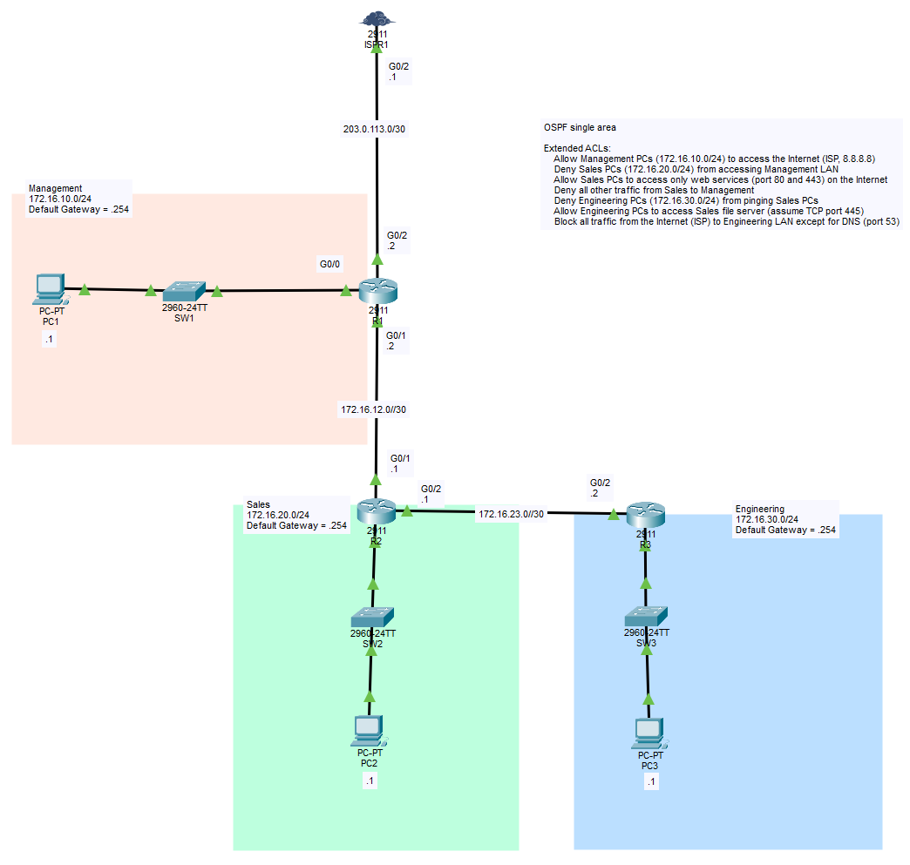

# Standard ACLs (named ACLs)

## Objective:

Configure OSPF for full connectivity, then apply Extended ACLs to control traffic between departments.
OSPF being a single area OSPF (Area 0).

ACL Requirement:
- Allow Management PCs (172.16.10.0/24) to access the Internet (ISP)
- Deny Sales PCs (172.16.20.0/24) from accessing Management LAN
- Allow Sales PCs to access only web services (port 80 and 443) on the Internet
- Deny all other traffic from Sales to Management
- Deny Engineering PCs (172.16.30.0/24) from pinging Sales PCs
- Allow Engineering PCs to access Sales file server (assume TCP port 445)
- Block all traffic from the Internet (ISP) to Engineering LAN except for DNS (port 53)


## Topology


## Subnets

|    Deparment   | IP Address        |
|----------------|-------------------|
|   Management   | 172.16.10.0/24    |
|   Sales        | 172.16.20.0/24    |
|   Engineering  | 172.16.30.0/24    |
|   ISP-to-R1    | 203.0.113.0/30    |
|   R1-to-R2     | 172.16.12.0/30    |
|   R2-ti-R3     | 172.16.23.0/30    |


## Learning Outcomes
- Named extended ACLs configurations
- !! Extended ACLs should apply onto the closest interface to the source !!

Revision of common port numbers:
```
TCP = 6
UDP = 17

HTTP = 80
HTTPS = 443
DNS = 53
EIGRP = 88
OSPF = 89

(ICMP doesn't have one)
```


CLI:
```
(config)# 
ip access-list extended __num__                                                             ## "number" can be used as strings for names

(config-std-nacl)#
__permit|deny__ __protocol__ __src-ip__ __wildcard_mask__ __condition__ __port-number__     ## ACL entry


Equal: eq = ==                                                                                   ## ACL condition and its Python counterpart
Greater than: gt = >
Less than: lt = <
Not Equal: neq = !=
range _num_ _num_ = range(_,_+1)
```