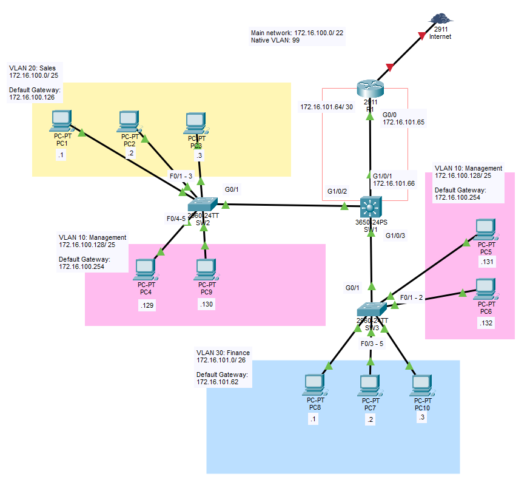
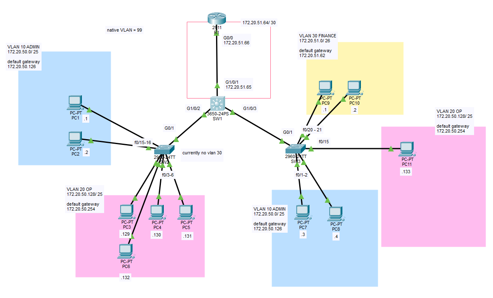

# Vlans and Trunking

## Objective:

Design a network based on a single network block: 172.16.100.0/ 22.

| VLAN ID |   Department   | Number of Hosts |
|---------|----------------|-----------------|
|    10   |   Management   |    80 hosts     |
|    20   |   Sales        |    120 hosts    |
|    30   |   Finance      |    50 hosts     |

Utilising SVI in a L3 switch, trunking and VLANs.
PCs should be able to communicate with each other across VLANS.

## Topology


## Subnets

|   Management   | IP Address        |
|----------------|-------------------|
|     Network    | 172.16.100.128/25 |
|   Subnet Mask  | 255.255.255.128   |
|   Broadcast    | 172.16.100.255    |
| First available| 172.16.100.129    |
| Last available | 172.16.100.254    |
|  Usable hosts  | (Quantity) 126    |

|      Sales     | IP Address       |
|----------------|------------------|
|     Network    | 172.16.100.0/25  |
|   Subnet Mask  | 255.255.255.128  |
|   Broadcast    | 172.16.100.127   |
| First available| 172.16.100.1     |
| Last available | 172.16.100.126   |
|  Usable hosts  | (Quantity) 126   |

|     Finance    | IP Address      |
|----------------|-----------------|
|     Network    | 172.16.101.0/26 |
|   Subnet Mask  | 255.255.255.192 |
|   Broadcast    | 172.16.101.63   |
| First available| 172.16.101.1    |
| Last available | 172.16.101.62   |
|  Usable hosts  | (Quantity) 62   |


## Learning Outcomes
- Hands-on calculation for subnetting.
- Commands and  Configuration for L2 switches and L3 switches.
- Comprehension of physical interfaces and virtual interfaces.
- Beware of source and destination of packets, theres no need to allow vlans if the vlan does not involve the switch even when its existing else where in the network.

!!!REMEMBER!!!:
```
ip routing       ##### to enable the L3 funuctions in L3 switches
no sw            ##### to change the L3 switch port to routing
no shut          ##### L3 interfaces are disabled by default
ip addr          ##### the interface needs an IP address when changed to a routing port
sw trunk native vlan __id__          #### each trunking interface requires to configure the native vlan
```

(P.S. Repitition of this practice should be carried out to solidify the whole process as it is relatively verbose.)


## Another quick practice with a slightly different network address

