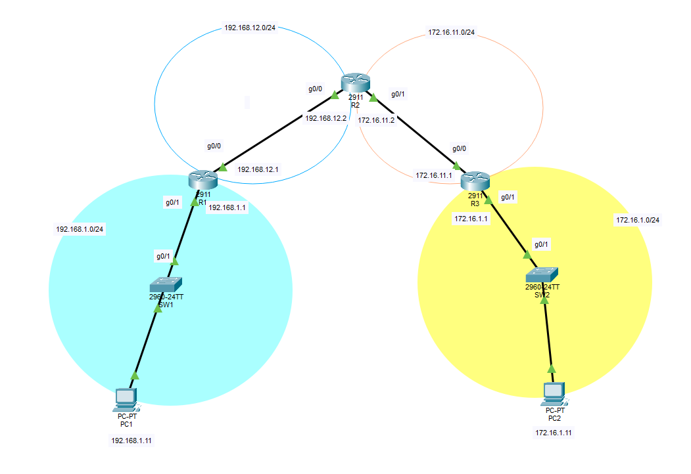

# Lab for Day9

Static routing configuration. End goal being PC1 can communicate with PC2 via 3 routers.



## Learning outcome

 - Routing configurations need to go both directions before end hosts can communicate with each other.
 - Don't forget setting the default gateway for the default route, 0.0.0.0  .

## Command learned
```
ip route 0.0.0.0 0.0.0.0 __next-hop__
```


