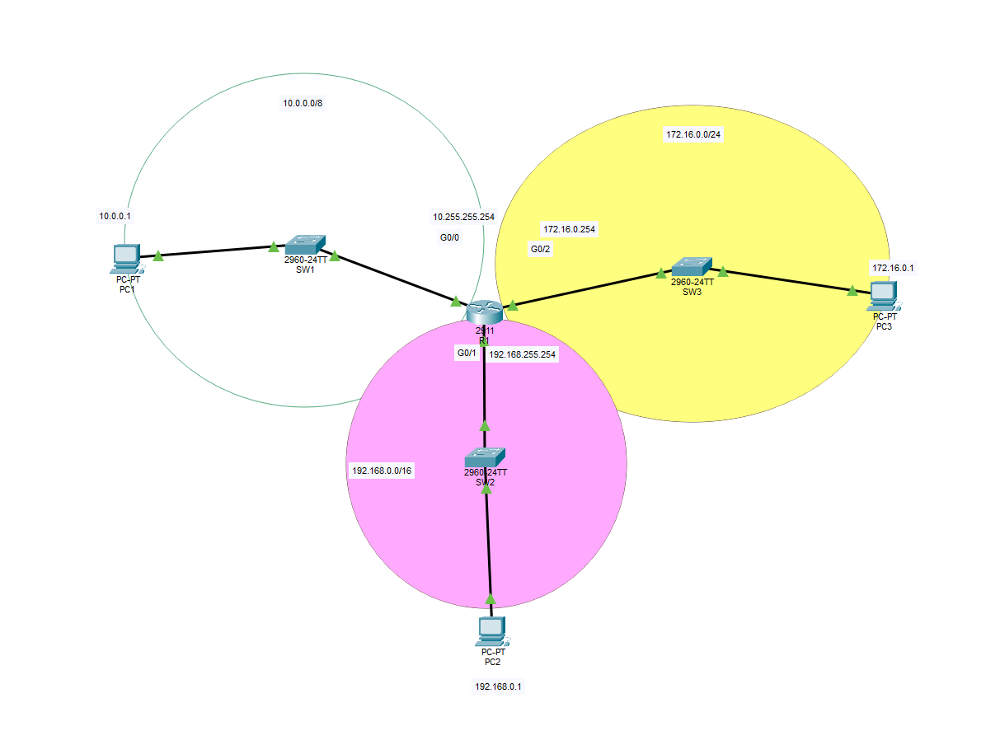

# Lab for Day8

IP address concepts and basic IP configurations for end hosts.
For learning purposes, the lab is recreated once manually.



## Learning outcome

 - Beware of the assigned CIDR and the IP addresses. One mistake being the subnet mask is set to /24 but the third ocetat was not following the subnet mask.
 - Don't forget to set the default gateway for PCs. It is needed for PCs to know where the router is before it can communicate with IP addresses outside its own subnet, and allow router forwarding packets.
 - Ping between PC and router can go through without default gateway because ARP is used. MAC instead of IP.

## Command learned
```
show mac address-table
show interface __port__
show ip interface brief

interface __port__
```
Packet Tracer's uses "show mac-address-table" when the actual command is without dash after "mac".

Switching between interfaces doesn't require exiting the current interface. Can simply switch on the spot.


