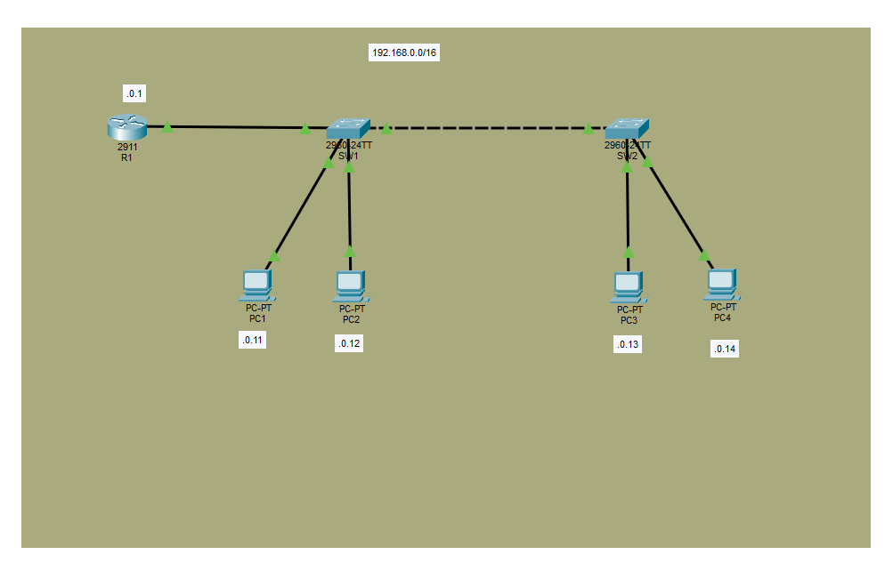

# Lab for Day9

Basic configurations for switches.



## Learning outcome

 - Mainly new command lines.
 - Speed and duplex are set individually in routers and switches. Or simply use autonegotiation.
 - Without autonegotiation, speed is detected by switches but duplex is not.

## Command learned
```
show interface status   ##only in switches
interface range __ports__

duplex __full_or_half_or_auto__
speed __10_or_100_or_1000_or_auto__
```


