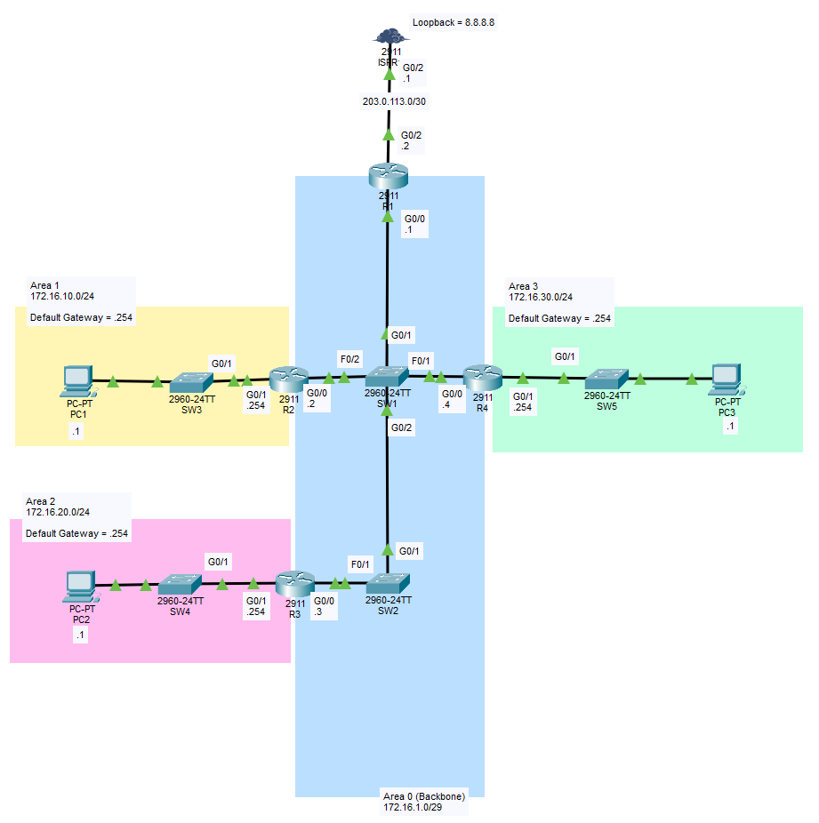

# OSPF Single Area

## Objective:

Configure a network with OSPF Multi-Area settings to provide routing.

## Topology

## Learning Outcomes
- !!REMEMBER to set passive-interface for access interfaces!!
- Sequence of setting up router loopback, id did affect the assignment of DR, BDR and DROther. Solution might be setting the router id before enabling OSPF (?)