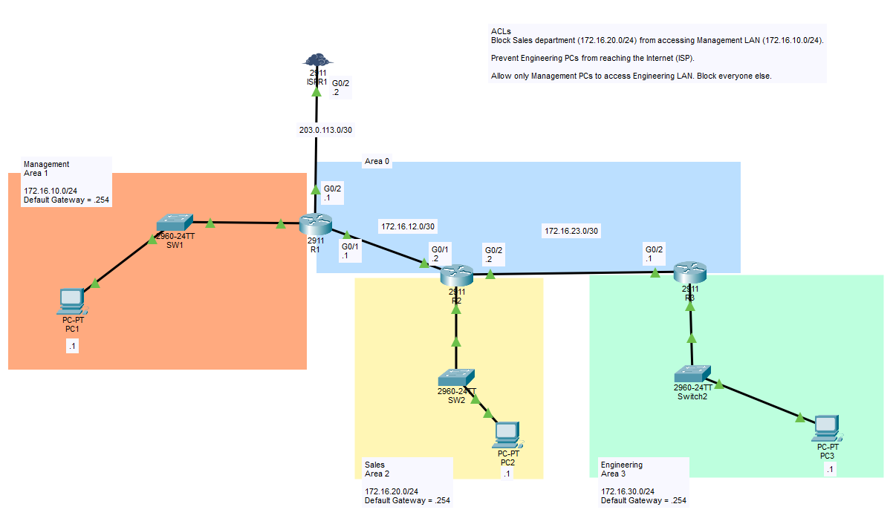

# Standard ACLs (named ACLs)

## Objective:

Configure OSPF for full connectivity, then apply Standard ACLs to control traffic between departments.
OSPF is to be a Multi-Area setting with Area 0 being the backbone.

ACL requirements:
- Sales cannot access Management LAN.
- Only Management can access Engineering LAN.
- Engineering should not be able to access the internet.


## Topology


## Subnets

|    Deparment   | IP Address        |
|----------------|-------------------|
|   Management   | 172.16.10.0/24    |
|   Sales        | 172.16.20.0/24    |
|   Engineering  | 172.16.30.0/24    |
|   ISP-to-R1    | 203.0.113.0/30    |
|   R1-to-R2     | 172.16.12.0/30    |
|   R2-ti-R3     | 172.16.23.0/30    |


## Learning Outcomes
- Revision of OSPF configurations
- Named ACLs configurations
- !! Standard ACLs should apply onto the closest interface to the destination !!
- "Timed out" messages would be the outcome of pings when ACLs are blocking the return trip.

CLI:
```
(config)# 
access-list __num__ __deny_or_permit__ __ip__ __wildcard_mask__               #### numbered standard ACL. Note that each ACE would need to do this CLI once.
access-list __num__ __deny_or_permit__ any                                    #### "any" == 0.0.0.0 255.255.255.255

(config-if)#
ip access-group __num__ __in_or_out__                                         #### to apply numbered ACL onto interface.

(config)#
ip access-list standard __name__                                              #### named standard ACL. Note that theres a "ip" and "standard".
permit __ip__
deny __ip__

(config-if)#
ip access-group __ACL_name__                                                  #### to apply named ACL onto interface.

(#)
show access-lists
```