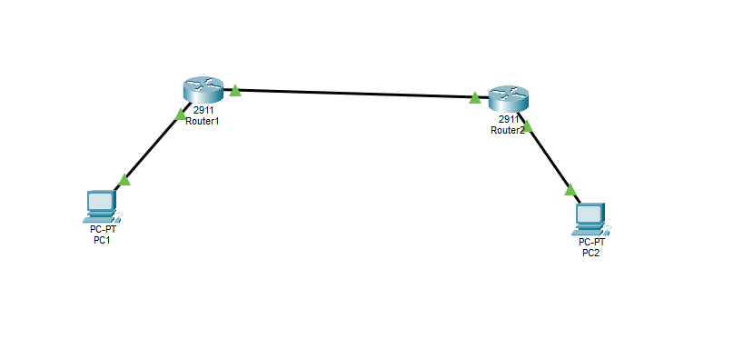

# Static Routing Basic Lab

## Objective:
Configure static routes so PC1 can communicate with PC2 through two routers (R1, R2).

## Topology


## IP Addressing

| Device | Interface     | IP Address      | Subnet Mask     |
|--------|---------------|-----------------|-----------------|
| R1     | Gi0/0         | 10.1.1.1        | 255.255.255.0   |
| R1     | Gi0/1         | 10.2.2.1        | 255.255.255.0   |
| R2     | Gi0/0         | 10.2.2.2        | 255.255.255.0   |
| R2     | Gi0/1         | 10.3.3.1        | 255.255.255.0   |
| PC1    | -             | 10.1.1.10       | 255.255.255.0   |
| PC2    | -             | 10.3.3.10       | 255.255.255.0   |

## Static Routes

**R1:**
```cisco
ip route 10.3.3.0 255.255.255.0 10.2.2.2
```
R2:
```cisco
ip route 10.1.1.0 255.255.255.0 10.2.2.1
```
