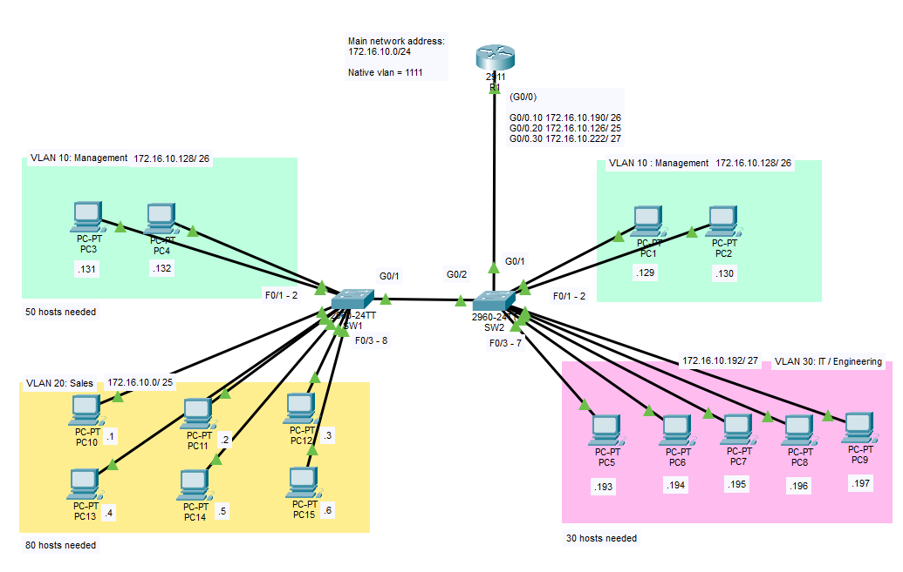

# Vlans and Trunking

## Objective:

Design a network based on a single network block: 172.16.10.0/24

| VLAN ID |   Department   | Number of Hosts |
|    10   |   Management   |    50 hosts     |
|    20   |   Sales        |    80 hosts     |
|    30   | IT/Engineering |    30 hosts     |

Utilising VLANS, Trunking and ROAS settings.\n
PCs should be able to communicate with each other across VLANS.

## Topology


## Subnets

|   Management   | IP Address       |
|----------------|------------------|
|     Network    | 172.16.10.128/26 |
|   Subnet Mask  | 255.255.255.192  |
|   Broadcast    | 172.16.10.191    |
| First available| 172.16.10.129    |
| Last available | 172.16.10.190    |
|  Usable hosts  | (Quantity) 64    |

|      Sales     | IP Address       |
|----------------|------------------|
|     Network    | 172.16.10.0/25   |
|   Subnet Mask  | 255.255.255.128  |
|   Broadcast    | 172.16.10.127    |
| First available| 172.16.10.1      |
| Last available | 172.16.10.126    |
|  Usable hosts  | (Quantity) 126   |

| IT/Engineering | IP Address       |
|----------------|------------------|
|     Network    | 172.16.10.192/27 |
|   Subnet Mask  | 255.255.255.224  |
|   Broadcast    | 172.16.10.223    |
| First available| 172.16.10.193    |
| Last available | 172.16.10.222    |
|  Usable hosts  | (Quantity) 32    |


## Learning Outcomes
- Hands-on calculation for subnetting.
- Commands and  Configuration for switches and routers

To check configuration in switches:
```
show vlan brief 
show interface trunk
show interface _port_
```