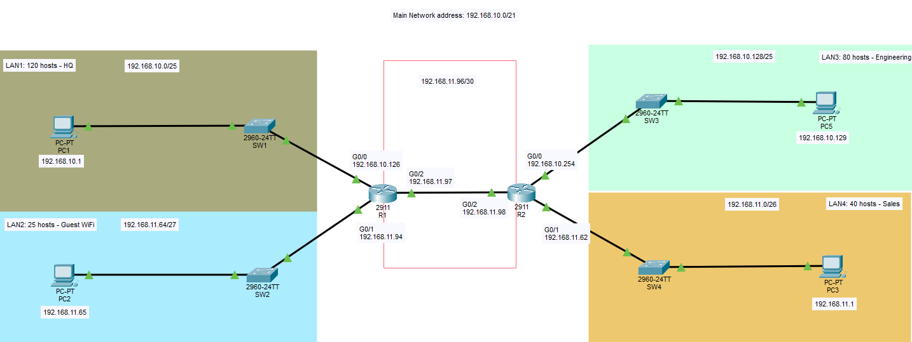

# VLSM - Static Routing Lab

## Objective:
- Design subnets base on an assigned network address, 192.168.10.0/21, using VLSM. 
- PCs can communicate with each other across network.
- 4 Departments: Headquarter - 120 hosts; Engineering - 80 hosts; Sales - 40 hosts; Guest Wifi - 25 hosts
- AI generated lab brief

## Topology


## Subnets

|   HeadQuarter  | IP Address      |
|----------------|-----------------|
|     Network    | 192.168.10.0/25 |
|   Subnet Mask  | 255.255.255.128 |
|   Broadcast    | 192.168.10.127  |
| First available| 192.168.10.1    |
| Last available | 192.168.10.126  |
|  Usable hosts  | (Quantity) 126  |

|   Engineering  | IP Address        |
|----------------|-------------------|
|     Network    | 192.168.10.128/25 |
|   Subnet Mask  | 255.255.255.128   |
|   Broadcast    | 192.168.10.255    |
| First available| 192.168.10.129    |
| Last available | 192.168.10.254    |
|  Usable hosts  | (Quantity) 126    |

|      Sales     | IP Address      |
|----------------|-----------------|
|     Network    | 192.168.11.0/26 |
|   Subnet Mask  | 255.255.255.192 |
|   Broadcast    | 192.168.11.63   |
| First available| 192.168.11.1    |
| Last available | 192.168.11.62   |
|  Usable hosts  | (Quantity) 62   |

|   Guest WiFi   | IP Address       |
|----------------|------------------|
|     Network    | 192.168.11.64/27 |
|   Subnet Mask  | 255.255.255.224  |
|   Broadcast    | 192.168.11.95    |
| First available| 192.168.11.65    |
| Last available | 192.168.11.94    |
|  Usable hosts  | (Quantity) 30    |

| Point-to-Point | IP Address       |
|----------------|------------------|
|     Network    | 192.168.11.96/30 |
|   Subnet Mask  | 255.255.255.252  |
|   Broadcast    | 192.168.11.99    |
| First available| 192.168.11.97    |
| Last available | 192.168.11.98    |
|  Usable hosts  | (Quantity) 2     |

## Static Routes

**R1:**
```cisco
ip route 192.168.10.128 255.255.255.128 192.168.11.98
ip route 192.168.11.0 255.255.255.192 192.168.11.98
```

**R2:**
```cisco
ip route 192.168.10.0 255.255.255.128 192.168.11.97
ip route 192.168.11.64 255.255.255.224 192.168.11.97
```

## Learning Outcomes
- Hands-on calculation for subnetting.
- Configuration for different end-hosts using CLI.